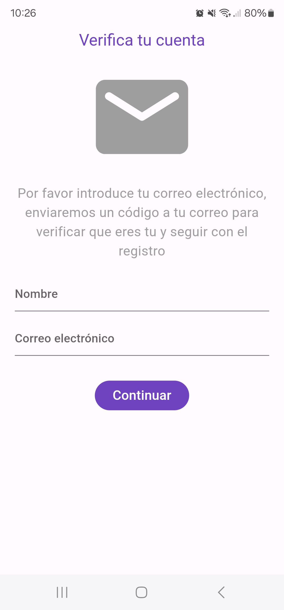
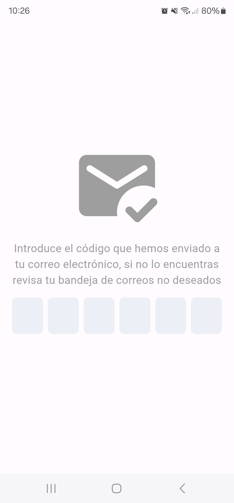
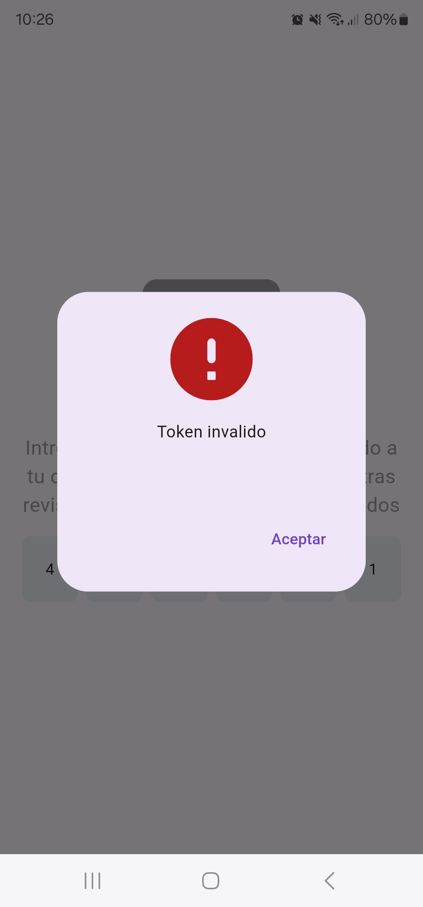
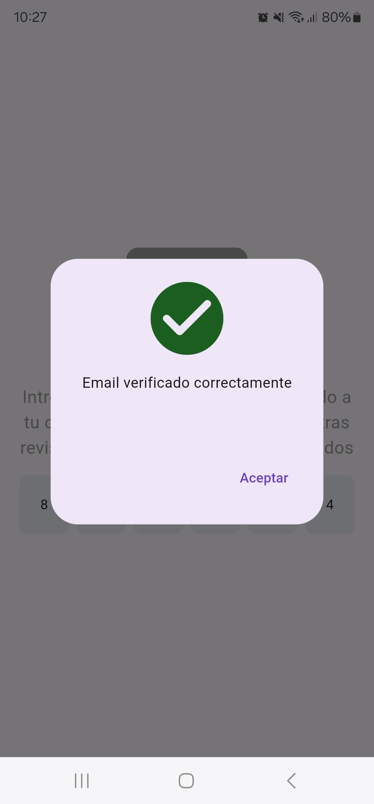

# OTP VALIDATOR

## Descripcion
El siguiente proyecto es un validador de correo electrónico, se utilizó Flutter para el Frontend, Node.js para el Backend y MySQL como gestor de base de datos. En este proyecto se utilizaron las siguientes librerias:

- Nodemailer(Para el envío de emails)
- mysql2 (Para la conexión con la base de datos MySQL)
- Dio (Para la realización de solicitudes http)

Este proyecto genera un token de verificación de 6 dígitos lo envía al correo electrónico ingresado por el usuario en el formulario y luego verifica que el token ingresado por el mismo sea el que se envió por email.

## Pasos para ejecutar el proyecto
1. Clona el repositorio utilizando el siguiente comando
    ```bash
    git clone https://github.com/juanjmorelos/flutter_node_otp_validator.git
    ```

2. Utilizando la terminal ingresa a la carpeta backend_node e instala las dependencias
    ```bash
    cd backend_node
    npm i
    ```

3. Crea una base de datos, luego en la consola de queries pega el siguiente query para así tener la estructura de tabla que espera el node
    ```SQL
    CREATE TABLE `users` (
    `userId` int(11) NOT NULL,
    `name` varchar(100) NOT NULL,
    `email` varchar(100) NOT NULL,
    `token` int(11) DEFAULT NULL
    ) ENGINE=InnoDB DEFAULT CHARSET=utf8 COLLATE=utf8_unicode_ci;

    ALTER TABLE `users`
    ADD PRIMARY KEY (`userId`);

    ALTER TABLE `users`
    MODIFY `userId` int(11) NOT NULL AUTO_INCREMENT, AUTO_INCREMENT=21;
    ```

4. Abre el archivo `backend_node/database/database.js` y asegurate de cambiar e ingresar el nombre de tu base de datos
    ```javascript
    const connection = sql.createPool({
        host: 'localhost',
        user: 'root',
        database: 'xxxxxxx', //Reemplaza con el nombre de tu base de datos
    });
    ```

5. Dirígete al archivo `backend_node/mail/mail.js` y asegurate de cambiar las variables necesarias
    ```javascript
    /* codigo */

    let transporter = nodemailer.createTransport({
        service: 'gmail',
        auth: {
            user: 'xxxxxxx@xxxxx.xxxx', // Remplaza con tu email
            pass: 'xxxxxxxxxxxxxxx' // Remplaza con tu contraseña
        }
    });

    /* codigo */

    const sendMail = async (mail, name, res) => {
    try {
        const token = Math.floor(Math.random() * 900000) + 100000;

        let mailOptions = {
            from: 'xxxxxxx@xxxxx.xxxx', //Reemplaza con tu email
            to: mail, // List of recipients
            subject: 'Token de acceso',
            html: template(name, token)
        };

    /*código*
    ```
6. Una vez realizado los cambios necesarios en el node.js procede a levantar el servidor 
    ```bash
    npm start
    ```
7. Obtén la dirección IP de tu equipo
    ```bash
    ipconfig     #Windows
    ifconfig     #Linux
    networksetup -getinfo wi-fi  #MacOS
    ```
8. Dirigete al siguiente archivo `frontend_flutter/lib/service/repository/verify_repository_impl.dart` y reemplaza la IP por la de tu equipo
    ```dart
    final dio = Dio(BaseOptions(
            baseUrl: 'http://xxxxx.xxxxx.xxx/', //Reemplaza por la ip de tu servidor
        )
    );
    ```
9. Ejecuta el proyecto flutter con `F5`y listo!

## Screenshots
&nbsp;&nbsp;&nbsp;&nbsp; <br/>    
&nbsp;&nbsp;&nbsp;&nbsp;
